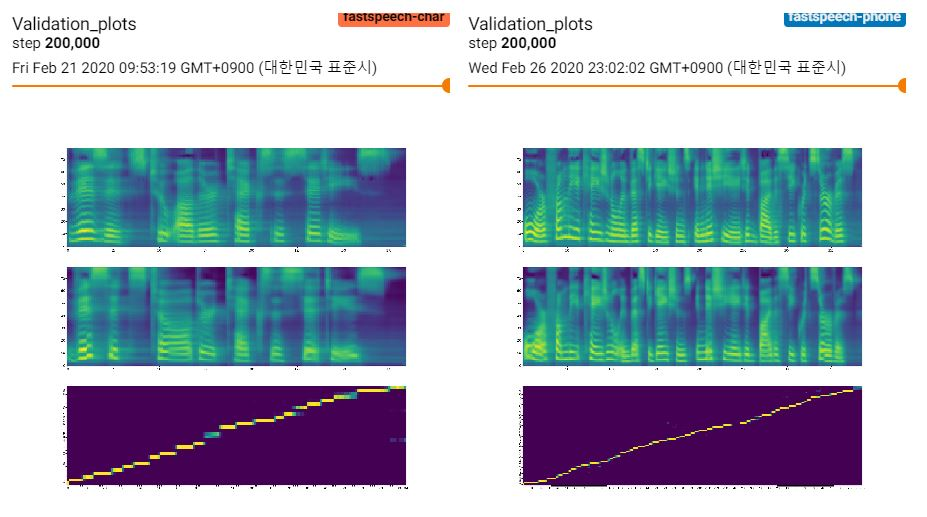

# FastSpeech
Implementation of ["FastSpeech: Fast, Robust and Controllable Text to Speech"](https://arxiv.org/abs/1905.09263)  
  
## Training  
0. Set `data_path` in `hparams.py` as the LJSpeech folder  
1. Set `teacher_dir` in `hparams.py` as the data directory where the alignments and melspectrogram targets are saved  
2. Put checkpoint of the pre-trained transformer-tts (weights of the embedding/encoder layers are used)  
3. `python train.py`  

## Training curves (orange: character  / blue: phoneme)  
##### The size of the train dataset is different because transformer-tts trained with phoneme shows more diagonal attention  
##### train:val:test=8:1:1, total => character:1126 / phoneme:3412  
  
  
  

## Training plots (orange: batch_size:64 / blue: batch_size:32)  

## Audio Samples    
You can hear the audio samples [here](https://leeyoonhyung.github.io/FastSpeech/)
