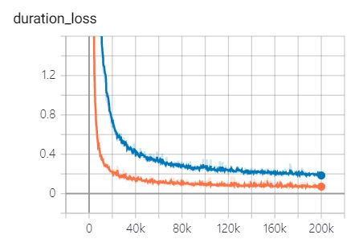
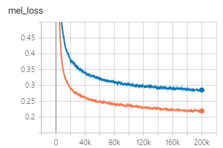

# FastSpeech
Implementation of ["FastSpeech: Fast, Robust and Controllable Text to Speech"](https://arxiv.org/abs/1905.09263)  
  
(2020/02/10)  
- I was able to finish the implementation of [Transformer-TTS](https://github.com/Deepest-Project/Transformer-TTS) by completing the Stop token prediction and remove the concatenation of inputs and outputs of multihead attention.  
- However, the alignments of the implementation are less diagonal, so it can not generate proper alignments for fastspeech.  
- As a result, I failed to train the fastspeech with the new transformer-tts implementation :(  

## Training  
0. Set `data_path` in `hparams.py` as the LJSpeech folder  
1. Set `teacher_dir` in `hparams.py` as the data directory where the alignments and melspectrogram targets are saved  
2. Set `teacer_model` as the pre-trained [transfomer-tts model](https://github.com/Deepest-Project/Transformer-TTS) for pretrained_embedding
3. `python train.py --gpu='0'`  

## Training curves (orange:  / blue: )  
  
  
  

## Training plots (orange: batch_size:64 / blue: batch_size:32)  

## Audio Samples    
You can hear the audio samples [here](https://leeyoonhyung.github.io/FastSpeech/)
